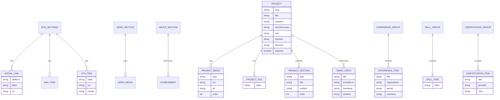

# PRD — Personal Portfolio Website

## 1. Product Overview

### 1.1 Product Name

Personal Portfolio Website — **Frans Budi Kashira**

### 1.2 Product Type

Static professional portfolio website.

### 1.3 Product Purpose

Build a polished, high-conversion portfolio website that presents Frans as a **Flutter-focused Mobile Developer** with real-world experience in **fintech, education, startup building, and freelance product development**.

The website should:

- Showcase flagship and supporting projects in a professional way.
- Demonstrate technical capability through structured case studies.
- Build trust through experience highlights, stack, demo videos, and achievements.
- Drive visitors toward clear actions such as contacting Frans, visiting freelance profiles, or reviewing project details.

### 1.4 Product Goals

- Establish a strong professional online presence.
- Position Frans as a serious developer, not only a content creator or student.
- Make flagship projects, especially **CPay**, easy to explore and understand.
- Improve credibility for recruiters, clients, Apple Developer Academy applications, and freelance platforms.
- Provide a reusable foundation for future expansion.

### 1.5 Non-Goals

This version will **not** include:

- Database
- Admin panel / CMS
- Authentication
- Blog system
- Comments
- Live chat backend
- User accounts
- Dynamic dashboards
- Multi-language support in V1

The website is **fully static**, with content managed directly in code/local content files.

---

## 2. Problem Statement

Frans already has strong projects, demo videos, and experience, but the current presentation is spread across PDFs, Canva portfolio slides, YouTube demos, and freelance platforms.

This creates several problems:

- No single professional destination for all work.
- Projects may appear as screenshots rather than structured case studies.
- Visitors may not quickly understand Frans's strengths, stack, or value.
- Conversion to inquiry/contact may be lower than necessary.
- Strong projects such as **CPay** may not get enough strategic emphasis.

The portfolio website should solve this by becoming the **main professional hub** for personal branding, project storytelling, and contact conversion.

---

## 3. Target Users

### 3.1 Primary Users

- Potential freelance clients
- Recruiters / hiring managers
- Startup founders / product owners
- Program evaluators (e.g. Apple Developer Academy)

### 3.2 Secondary Users

- Fellow developers
- Social media audience who want deeper proof of work
- Potential collaborators

### 3.3 User Needs

Users should be able to quickly answer:

- Who is Frans?
- What kind of developer is he?
- What projects has he built?
- What role did he play in each project?
- What technologies does he use?
- How can he be contacted?
- Can his work be trusted as real and production-oriented?

---

## 4. Product Positioning

### 4.1 Core Positioning Statement

A premium dark-themed portfolio website for a **Flutter Mobile Developer** who builds real-world mobile-first products across **fintech, education, and digital business**.

### 4.2 Differentiators

- Real-world freelance project experience
- Strong flagship fintech case study (**CPay**)
- Mobile + web + backend system exposure
- Video demo assets already available
- Founder / startup CTO background
- Combination of technical depth and product thinking

---

## 5. Success Criteria

### 5.1 Business / Outcome Metrics

- Visitors can identify Frans's role and strengths within 5 seconds.
- Visitors can access flagship projects within 1–2 clicks.
- Contact CTA is always visible or easily reachable.
- The site feels premium enough to support portfolio, job, and freelance use cases.

### 5.2 UX Success Criteria

- Homepage communicates identity, proof, and CTA clearly.
- Project case studies feel structured, not like screenshot dumps.
- Site works smoothly on desktop, tablet, and mobile.
- Media-heavy pages still load efficiently.

---

## 6. Scope

### 6.1 In Scope

- Static homepage
- Static projects listing
- Static project detail / case study pages
- Demo video embeds
- Social links
- Contact CTA section
- Experience highlights
- Skills / tech stack section
- Achievements / certifications section
- Responsive design
- SEO basics
- Animations / transitions
- Reusable UI system

### 6.2 Out of Scope

- CMS
- Server-side forms
- Database persistence
- Dashboard analytics backend
- User login
- Content editing panel

---

## 7. Information Architecture

## 7.1 Proposed Routes

- `/` — Homepage
- `/projects` — Project listing page
- `/projects/cpay` — Flagship case study page
- `/projects/fit-lit` — Supporting project page
- `/projects/bangunaja` — Supporting project page
- `/projects/chefies` — Supporting project page
- `/projects/chatgpt` — Supporting project page
- `/projects/whatsapp-clone` — Supporting project page
- `/projects/presence` — Supporting project page
- `/projects/easyprod` — Supporting project page
- `/resume` — Optional downloadable resume / CV hub
- `/contact` — Optional dedicated contact page

> Note: For V1, `/resume` and `/contact` may remain sections instead of separate routes if simplicity is preferred.

### 7.2 Recommended Navigation

- Home
- Projects
- About
- Resume
- Contact

### 7.3 Footer Links

- LinkedIn
- GitHub
- YouTube
- Instagram
- TikTok
- Email
- Freelance platform links (Upwork / Fiverr / Contra if used)

---

## 8. Homepage Structure

The homepage should be designed as a conversion-oriented one-page overview with strong routing into project detail pages.

### 8.1 Hero Section

**Goal:** Immediate positioning.

**Must include:**

- Name: Frans Budi Kashira
- Title: Flutter Mobile Developer
- Supporting one-line statement
- Primary CTA: `View Projects`
- Secondary CTA: `Contact Me`
- Premium visual composition using dummy mockups/project visuals

**Recommended copy direction:**

> Building real-world mobile-first products across fintech, education, and digital business.

### 8.2 About Section

**Goal:** Short, credible summary.

**Must include:**

- 4+ years programming experience
- Freelance experience
- Focus on Flutter / mobile-first products
- Fintech + education project background
- Startup CTO background

### 8.3 Featured Projects Section

**Goal:** Showcase strongest work quickly.

**Recommended order:**

1. CPay
2. Fit Lit
3. BangunAja
4. Presence
5. ChatGPT
6. Chefies
7. WhatsApp Clone
8. EasyProd

Each project card should include:

- Thumbnail / hero image
- Project title
- Short summary
- Tags / stack
- CTA: `View Case Study`

> Note: Not all projects are required to have YouTube demo videos. The portfolio system should support projects with or without embedded demo content.

### 8.4 Skills / Core Stack Section

**Goal:** Show technical capability cleanly.

Use grouped chips or cards.

Suggested groups:

- Mobile Development
- Backend & Web
- Payments & Fintech
- Databases & Services
- Tools & Workflow

### 8.5 Experience Highlights Section

**Goal:** Add trust and career context.

Should include:

- Freelance Mobile Developer
- Mobile Developer Intern
- Startup CTO

### 8.6 Demo Videos Section

**Goal:** Prove real working products.

Should include:

- Project thumbnail
- Video title
- Short note
- Embedded YouTube video or preview card linked to YouTube

### 8.7 Achievements / Certifications Section

**Goal:** Reinforce credibility without overwhelming.

Suggested items:

- Bangkit Academy — Mobile Development
- Dicoding — Android Development Track
- WPU Course — Web Development
- Startup / scholarship highlights (optional condensed version)

### 8.8 Contact / CTA Section

**Goal:** Maximize conversion.

Must include:

- Email CTA
- WhatsApp CTA
- Freelance profile CTA (if applicable)
- Optional download resume button

### 8.9 Footer

Should include:

- Navigation shortcuts
- Social links
- Copyright
- Quick contact info

---

## 9. Project Showcase Strategy

## 9.1 Portfolio Showcase Principles

Projects must not be presented as mere screenshots. Each project should communicate:

- What the project is
- Why it matters
- What problem it solves
- What Frans built
- What stack was used
- What is visually impressive about it

### 9.2 Project Card Content

Each project card should contain:

- Project title
- Category
- One-sentence description
- Core stack tags
- Thumbnail / preview image
- Link to case study

### 9.3 Project Hierarchy

#### Flagship Project

- **CPay**

#### Strong Supporting Projects

- Fit Lit
- BangunAja
- Presence
- ChatGPT

#### Secondary Supporting Projects

- Chefies
- WhatsApp Clone
- EasyProd

---

## 10. Project Case Study Structure

Each case study page should follow a consistent storytelling structure.

### 10.1 Required Sections

1. Hero / Overview
2. Problem
3. Solution
4. My Role
5. Key Features
6. Technical Highlights
7. Visual Showcase
8. Demo Video _(optional per project)_
9. Stack Used
10. Outcome / Value
11. CTA to contact / view more projects

> Note: Demo video is optional because not every project currently has a YouTube demo.

### 10.2 Case Study Example — CPay

#### Hero

- Title: CPay
- Subtitle: Fintech Mobile & Web Platform
- Client context: Saudi Arabia-based client
- Duration
- Role
- Scope

#### Problem

Explain merchant needs for invoices, orders, payment links, products, refunds, and operations.

#### Solution

Explain end-to-end platform: mobile app, web payment flows, backend services, admin dashboard.

#### My Role

Highlight Frans's responsibility across planning, mobile, web flows, integration, and admin features.

#### Key Features

Grouped instead of long raw bullet lists.

Suggested groups:

- Merchant onboarding
- Payment workflows
- Business management
- Admin & analytics
- Localization & payment gateway

#### Technical Highlights

- Flutter app
- Next.js web flows
- Express.js backend
- Firebase services
- Tap Payments integration
- Fee / tax logic
- EN / AR support
- Reporting jobs

#### Outcome / Value

Explain business value even if hard metrics are unavailable.

---

## 11. Functional Requirements

## 11.1 Global Requirements

- The website must be fully responsive.
- The website must be static and deployable without a backend.
- The website must support media-rich content efficiently.
- The website must maintain consistent dark-theme branding.
- The website must provide clear navigation and CTA access.

### 11.2 Homepage Requirements

- Show clear role and positioning above the fold.
- Display at least one primary CTA in hero section.
- Display at least 3–4 project highlights.
- Include social proof / credibility indicators.
- Include contact section before footer.

### 11.3 Project Listing Requirements

- Show grid/list of projects.
- Each item must include summary, tags, and link.
- Cards must be easy to scan.

### 11.4 Case Study Requirements

- Each case study must use consistent layout.
- Each case study must support image galleries.
- Each case study must support YouTube demo embeds when available.
- Each case study must gracefully handle projects without demo videos.
- Each case study must support stack tags and role details.

### 11.5 Contact Requirements

- Contact actions must be visible and simple.
- CTA buttons should support:
  - Email
  - WhatsApp
  - LinkedIn
  - Freelance links

### 11.6 Social Requirements

- Show professional-first ordering of social links.
- LinkedIn and GitHub should be most prominent.

### 11.7 SEO Requirements

- Per-page metadata
- Open Graph tags
- Descriptive page titles
- Proper headings hierarchy
- Semantic HTML

---

## 12. Non-Functional Requirements

### 12.1 Performance

- Use optimized images.
- Use lazy loading for below-the-fold media.
- Avoid heavy unnecessary JavaScript.
- YouTube embeds should be optimized to avoid slowing first load.

### 12.2 Accessibility

- Sufficient contrast ratio
- Keyboard navigable buttons/links
- Semantic heading hierarchy
- Alt text for images
- Visible focus states

### 12.3 Responsiveness

- Desktop-first polish
- Tablet-safe layout
- Strong mobile experience

### 12.4 Maintainability

- Content should be easy to update in code/local content files.
- Components should be reusable.
- Project pages should share common template structure.

---

## 13. User Flow

## 13.1 Primary Flow — Recruiter / Client

1. User lands on homepage
2. Reads hero positioning
3. Scrolls to featured projects
4. Opens CPay case study
5. Reviews visuals, role, technical highlights, and demo video
6. Clicks Contact CTA
7. Sends message via email / WhatsApp / freelance platform

### 13.2 Secondary Flow — Social Audience

1. User arrives from Instagram / YouTube / LinkedIn
2. Lands on homepage or project case study
3. Watches demo videos / scans projects
4. Explores more work
5. Follows socials or contacts Frans

### 13.3 Validation Flow — Apple Academy / Evaluator

1. User lands on homepage
2. Reads About + Experience + Projects
3. Opens detailed project case studies
4. Reviews professionalism and structure
5. Downloads resume or contacts Frans if needed

---

## 14. Core Features

### 14.1 Hero Branding Section

- Strong headline
- Supporting line
- CTA buttons
- Premium visual composition

### 14.2 Featured Project Showcase

- Project cards
- Tags
- Thumbnail/motion preview
- Link to case study

### 14.3 Detailed Case Study Pages

- Structured storytelling
- Visual galleries
- Demo embeds
- Role + stack + highlights

### 14.4 Demo Video Integration

- Embedded YouTube section or preview cards
- Thumbnail-first loading strategy
- Optional per project
- Fallback layout for projects without video demo

### 14.5 Skills / Core Stack Display

- Grouped technical skills
- Clean visual presentation

### 14.6 Experience Highlights

- Timeline or card-based highlights

### 14.7 Social & CTA Section

- Clear contact paths
- Professional social links

### 14.8 Resume / Download Access

- Optional downloadable PDF resume / CV

---

## 15. Content Model (Static)

Since the website is static, content will be stored in local files rather than a database.

### 15.1 Recommended Content Sources

- TypeScript content objects
- JSON files
- MDX files for case studies

### 15.2 Recommended Content Types

- Site settings
- Hero content
- About content
- Social links
- Skills groups
- Experience items
- Project summaries
- Project case studies
- Video items
- Certifications
- CTA blocks

---

## 16. Architecture

## 16.1 Architecture Type

Static site architecture using **Next.js** with build-time rendering.

### 16.2 Rendering Strategy

Preferred:

- Static generation for all pages
- No server-side rendering needed for V1
- Deploy on Vercel

### 16.3 Content Strategy

Use local static content files, e.g.:

- `src/content/projects/*.mdx`
- `src/content/site.ts`
- `src/content/experience.ts`
- `src/content/skills.ts`

### 16.4 Component Strategy

Use modular reusable components:

- HeroSection
- AboutSection
- ProjectCard
- CaseStudyHero
- CaseStudySection
- StackChips
- VideoCard
- CTASection
- SocialLinks
- SectionHeader
- Timeline / ExperienceCard

### 16.5 Media Strategy

- Store optimized images locally or in public assets
- Use `next/image`
- Use lightweight video preview strategy for embeds

---

## 17. Recommended Tech Stack

### 17.1 Core Stack

- **Next.js**
- **TypeScript**
- **Tailwind CSS**
- **shadcn/ui**

### 17.2 Recommended Supporting Packages

- **Framer Motion** — for subtle animation and section transitions
- **Lucide React** — consistent icons
- **class-variance-authority** — scalable component variants
- **tailwind-merge** — clean class merging
- **clsx** — class composition helper
- **next-themes** — optional, but not required for V1 because dark-only theme
- **Embla Carousel** or **Swiper** — if screenshot carousels are needed
- **react-player** or lightweight YouTube embed alternative — for demo video embedding
- **MDX** support — for writing project case studies in a maintainable way

### 17.3 Recommended Utilities

- `next/font` for typography loading
- `@tailwindcss/typography` if MDX/article-style formatting is used
- `sharp` or standard image optimization workflow for assets

---

## 18. Design Direction

## 18.1 Theme Direction

- Dark theme only for V1
- Premium, modern, mobile-product-focused
- Strong contrast
- Plenty of whitespace
- Smooth but restrained animation
- Clean developer/product aesthetic

### 18.2 Color Palette

#### Required Colors

- **Primary:** `#5CE1E6`
- **Background:** `#242323`

#### Recommended Supporting Palette

- **Surface / Card:** `#2E2D2D`
- **Surface Elevated:** `#353434`
- **Border / Divider:** `#434141`
- **Text Primary:** `#F5F7F7`
- **Text Secondary:** `#B8C0C2`
- **Muted Text:** `#8B9498`
- **Accent Deep Cyan:** `#2CBCC4`
- **Accent Glow:** `rgba(92, 225, 230, 0.18)`
- **Success / positive highlights:** `#4ADE80`
- **Warning / secondary highlight:** `#FBBF24`

### 18.3 Typography Direction

Should feel modern and readable.

Recommended pairing:

- Primary font: **Inter** or **Manrope**
- Display / heading font: **Sora** or **Space Grotesk** (optional)

### 18.4 Visual Style

- Rounded corners, not overly soft
- Thin borders with subtle glow
- Gradient accent usage in hero or section headings
- Screen mockups and media should be the visual focus
- Avoid over-cluttered backgrounds
- Use motion carefully for premium feel

### 18.5 Animation Direction

Use subtle animation only:

- fade up on section entrance
- small stagger on cards
- hover transitions
- carousel transitions for screenshots
- CTA hover glow / lift

Avoid:

- excessive parallax
- loud animated backgrounds
- distracting repeated motion

---

## 19. Design Constraints

- Must remain readable on dark background.
- Must not rely too heavily on neon/glow effects.
- Primary color should be used strategically, not everywhere.
- Project screenshots and videos must remain the focus.
- Layout should work well with placeholder/dummy media first.

---

## 20. Technical Constraints

- Static site only
- No runtime database
- No server-side forms in V1
- Content should be easy to update by editing code/content files
- Large media must be optimized to avoid performance degradation
- YouTube embeds must not slow initial load excessively

---

## 21. Dummy Asset Plan

All imagery can use dummy placeholders in V1 layout implementation.

### 21.1 Dummy Asset Categories

- Hero mockup placeholder
- Project thumbnails
- Project screenshot galleries
- Video thumbnail placeholders
- Resume preview image
- Contact / CTA illustration if needed

### 21.2 Naming Recommendation

- `hero-placeholder.webp`
- `project-cpay-cover.webp`
- `project-fitlit-cover.webp`
- `project-bangunaja-cover.webp`
- `project-chefies-cover.webp`
- `project-chatgpt-cover.webp`
- `project-whatsapp-clone-cover.webp`
- `project-presence-cover.webp`
- `project-easyprod-cover.webp`
- `demo-cpay-thumb.webp`
- `demo-fitlit-thumb.webp`

---

## 22. Content Requirements Per Project

### 22.1 Minimum Data Per Project

- slug
- title
- category
- short summary
- long summary
- stack array
- thumbnail
- hero image
- gallery images
- optional YouTube demo URL
- role
- duration
- highlights
- problem
- solution
- outcome

### 22.2 Planned Project List

#### 1. CPay

- Flagship fintech project
- Mobile app, web payment flows, backend, admin dashboard, analytics

#### 2. Fit Lit

- Interactive sports app offering guided games with individual and group modes
- Users can complete games, submit evaluations, and track their progress

#### 3. BangunAja

- Construction application connecting users with skilled professionals for repair and building needs efficiently and professionally

#### 4. Chefies

- Food recommendation app integrated with machine learning to suggest menus based on ingredients currently available to the user

#### 5. ChatGPT

- AI-powered application utilizing OpenAI technology for text, voice, and image interaction using GPT, DALL·E 3, and Whisper

#### 6. WhatsApp Clone

- Real-time messaging app with OTP login, text and image messaging, and online/offline presence indicators

#### 7. Presence

- Employee attendance management app with authentication, role-based authorization, profile management, email password recovery, and location tracking

#### 8. EasyProd

- Product management application with QR code scanning to help employees quickly search and manage product data

### 22.3 Project Priority

#### Tier 1

- CPay

#### Tier 2

- Fit Lit
- BangunAja
- Presence
- ChatGPT

#### Tier 3

- Chefies
- WhatsApp Clone
- EasyProd

## 23. Content Relationship Diagram (Static ERD)

> Note: This is a **content model diagram**, not a runtime database schema.

---

## 24. SEO Strategy

### 24.1 Homepage SEO

- Title: Frans Budi Kashira — Flutter Mobile Developer
- Meta description emphasizing fintech, education, mobile-first products, and portfolio
- Open Graph preview with branded hero image

### 24.2 Project Page SEO

- Each project page should have unique title and description
- OG image should ideally be project-specific

### 24.3 Structured Data (Optional)

- Person schema
- CreativeWork / Project schema (optional future enhancement)

---

## 25. Development Phases

## Phase 1 — Foundation

- Setup Next.js project
- Install Tailwind and shadcn/ui
- Setup theme tokens and typography
- Setup base layout, navigation, footer
- Create reusable section and card components

### Deliverables

- Project scaffold
- Global theme
- Base component system

## Phase 2 — Homepage

- Hero section
- About section
- Featured projects
- Skills
- Experience highlights
- CTA / contact
- Footer

### Deliverables

- Fully working homepage

## Phase 3 — Project System

- Project data structure
- Projects listing page
- Dynamic static routes for project detail pages
- Reusable case study page template

### Deliverables

- `/projects`
- `/projects/[slug]`

## Phase 4 — Flagship Case Study

- Build CPay detail page first
- Add gallery, stack, role, and demo video
- Refine layout and storytelling quality

### Deliverables

- Production-ready CPay case study page

## Phase 5 — Supporting Projects

- Add Fit Lit
- Add BangunAja
- Add Presence
- Add ChatGPT
- Add Chefies
- Add WhatsApp Clone
- Add EasyProd

### Deliverables

- Remaining project pages

## Phase 6 — Polish & Optimization

- Add subtle animations
- Improve responsive behavior
- Optimize images and embeds
- Add SEO metadata

### Deliverables

- V1 ready for deployment

## Phase 7 — Deployment

- Deploy on Vercel
- Test on desktop/mobile
- Final copy refinement
- Replace dummy assets with final media

### Deliverables

- Live production portfolio

---

## 26. Launch Checklist

- Homepage complete
- At least 2 detailed case studies complete
- Social links working
- CTA links working
- Resume file available if included
- Images optimized
- Metadata added
- Mobile layout verified
- Dummy assets replaced where necessary

---

## 27. Future Enhancements

These are intentionally excluded from V1 but should remain possible:

- Multi-language support (EN / ID / AR)
- Blog / articles
- CMS integration
- Downloadable project PDF case studies
- Testimonials section
- Advanced filtering on projects
- Interactive timeline
- Theme switching (light/dark)
- Contact form with backend service

---

## 28. Final Recommendation Summary

For V1, the portfolio website should optimize for:

- **clarity of identity**
- **high-quality flagship case study presentation**
- **professional visual design**
- **strong CTA conversion**
- **maintainable static architecture**

The website should feel like a premium product showcase, not a simple gallery or student portfolio.

The single most important page to polish first is:

- **CPay case study page**

The single most important homepage behavior to achieve is:

- Visitors immediately understand that Frans is a **Flutter Mobile Developer who builds real-world products**.
